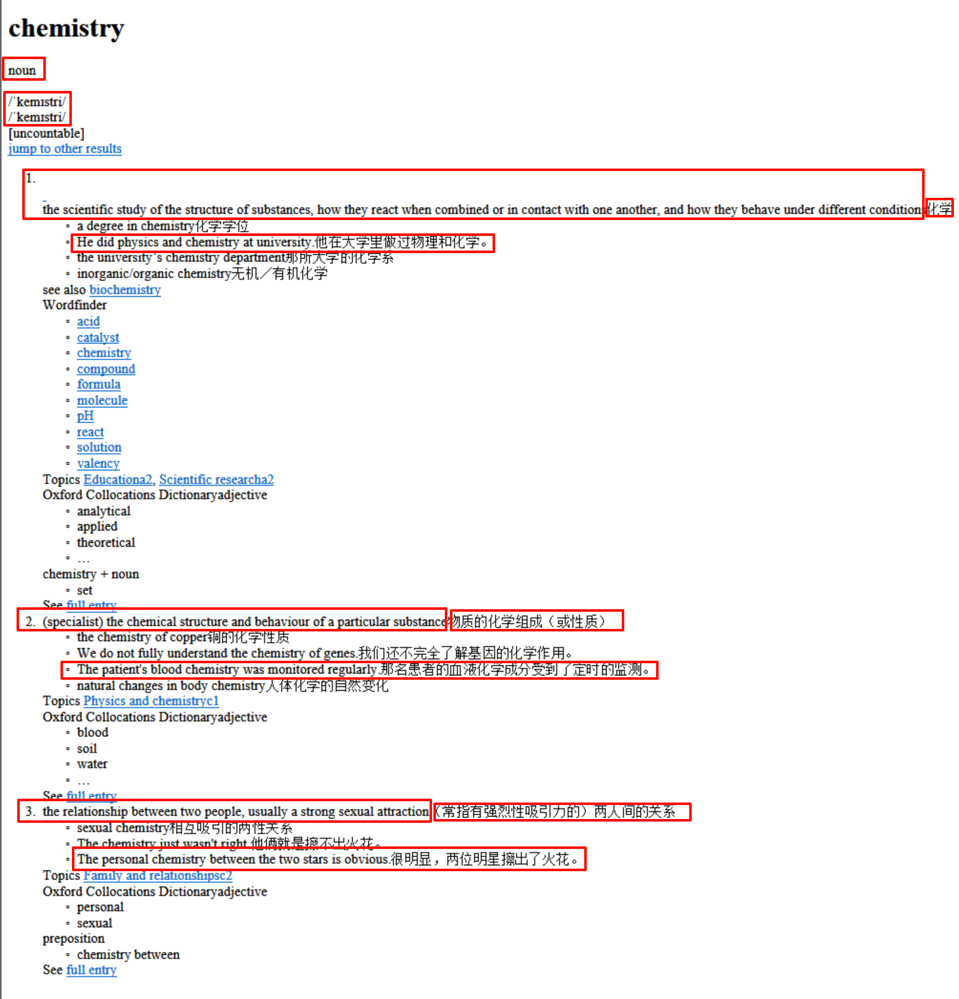
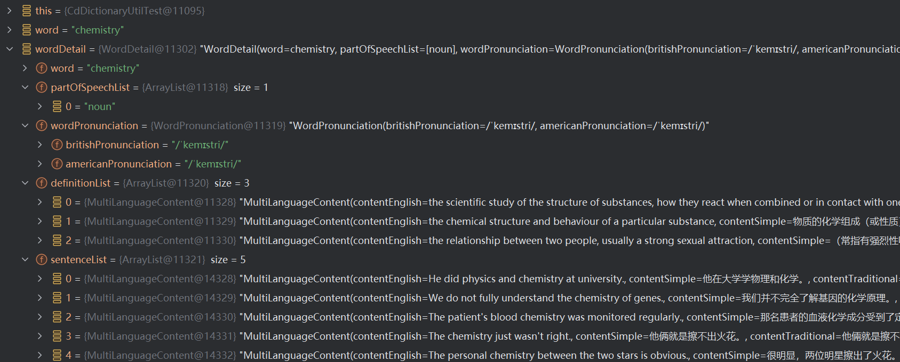

# 开发日志

## TODO
- [ ] 生成百词斩日志封面图片
- [ ] 生成多邻国日志封面图片
- [ ] Java通过命令wmv视频转mp4
- [ ] 生成听力视频（开始提示音，两遍男声两遍无字幕，女声一遍有字幕，男声一遍有字幕）

## 20250101

- [x] 给MarkDownload文件的单词补上音标
  - MarkdownWordUtil.fillWordPhonetics(markdownFilePath)

- [x] 优化根据百词斩完整文档生成每日《考研词汇精选》，补上音标
  - MarkdownSplitterAdvanced

## 20241231

- [x] （1）通过字典查询单词 https://github.com/Grinner2436/mdict-java
  - NormalDictUtil.query("hello");【牛津高阶8简体】
  - SimpleDictUtil.query("hello");【Cambridge English-Chinese (Simplified) Dictionary】
- [ ] （2）通过其他字典查询单词
  - HtmlCollinsParser.query()
  - HtmlOaldpeParser.query();
  - HtmlOaldParser.query();

## 20241230

- [x] 将对话脚本文件分割成短句
  - TextUtil.writeSentenceToFile(filePath, fileName);
- [x] 英中文对话句子中间增加音标
  - TranslationUtil.genPhonetics(fileName)

## 20241229

- [x] 分割长图片
  - ImageSplitterUtil
- [x] PDF保存为图片，可以设置清晰度ppi
  - PdfToImageConverterUtil

## 20241228

- [x] 优雅的执行Windows控制台的命令
  - CommandUtil.executeCommand(command);
  - CommandExecutorTest.executeCommand_DeployHexo() 打包发布Hexo
- [x] 根据原始文本生成字幕文本
  - SubtitleParser

## 20241227

- [x] 优化根据百词斩完整文档生成每日《考研词汇精选》
  - MarkdownSplitterAdvanced
- [x] 优化根据Excel生成高级词汇表图片
  - HighResImageGenUtil2
  
## 20241225

- [x] 根据百词斩完整文档生成每日《考研词汇精选》
  - MarkdownSplitterAdvanced
- [x] 根据图片生成公众号《六分钟英语》
  - MarkdownFileGenerator
- [x] Java通过调用cmd命令打包发布hexo
  - CmdUtil3

## 20241224

- [x]  通过Google Gemini API查询，翻译单词和句子，填充voc_cn.txt
  - DictUtil.processVocWithGemini()
- [x] 通过调用Google Youtube API，查看油管频道简介
  - YouTubeApiUtil.processUsernames(usernames)

## 20241223

#### 测试类`CdDictionaryUtilTest`

### 返回

* 词性1个
* 发音
* 定义3个
* 句子5个

### 缺陷修复与代码优化

#### 无法取消引用void

报错信息 **“java: 无法取消引用void”** 的根本原因是 `lombok` 的 `@Data` 注解会自动为你的类生成 **setter** 方法，但这些生成的 `setter` 方法返回类型是 `void`。因此，你不能在这些 `setter` 方法上进行链式调用（方法调用后返回的是 `void`）。

例如，`setSource()` 返回类型为 `void`，所以 `new DictionaryEntity().setSource(source)` 会引发“无法取消引用 `void`”的错误。

**使用 Lombok 的 `@Accessors` 注解**

Lombok 提供了一个 `@Accessors` 注解，可以为你的类自动生成支持链式调用的 `setter` 方法。

**解释**：

- `@Accessors(chain = true)` 告诉 Lombok 生成支持链式调用的 `setter` 方法。
- 例如，`setSource()` 的返回类型会变为 `DictionaryEntity` 而不是 `void`。

### v0.0.1-20241214

* 实现单词从`youdao.com`查询
* 实现单词从字典`牛津高阶英汉双解词典第10版完美版`查询
* 实现单词翻译和英文解释翻译从`ChatGPT`获取
* 实现单词的中英文例句从`ChatGPT`获取

